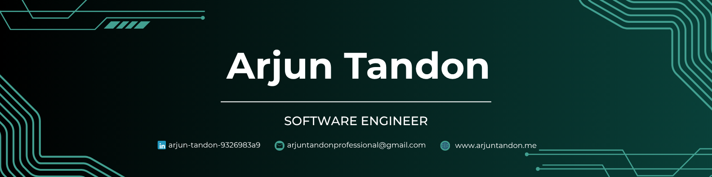

Building products, solving problems, and continuously learning along the way.

---

## About Me

I'm a software engineer based in India, passionate about building thoughtful digital experiences and solving challenging problems through technology.

I enjoy creating products that are reliable, scalable, and genuinely useful. For me, software engineering is about more than writing code - it's about turning ideas into something people can use and benefit from.

This portfolio is a collection of projects, experiments, and experiences that reflect my journey as a developer and lifelong learner.

---

### Building. Learning. Improving.

